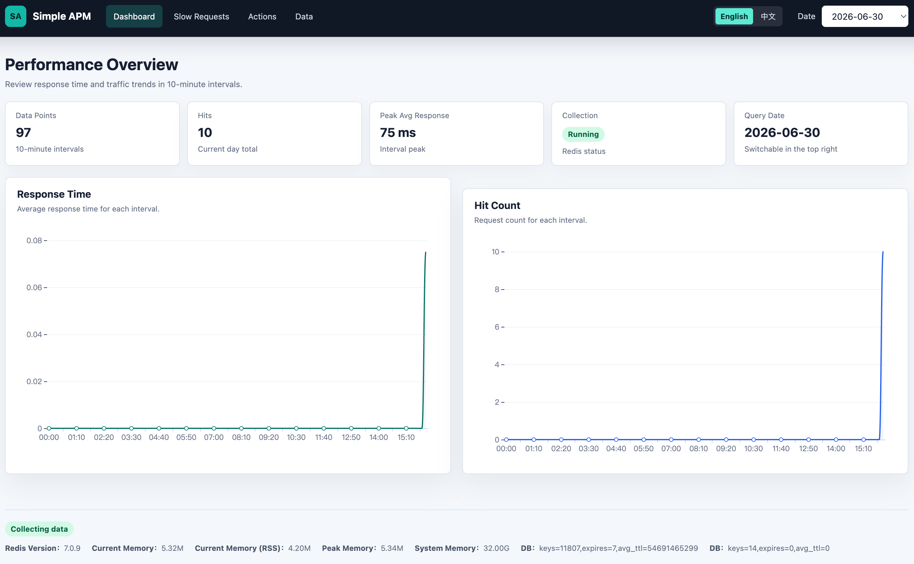
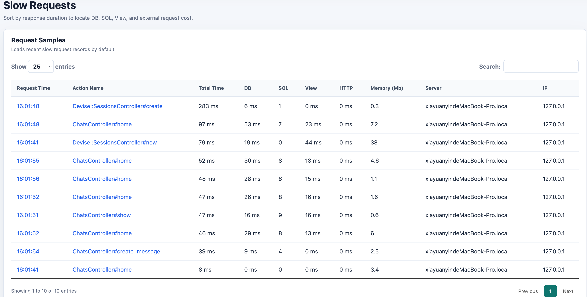
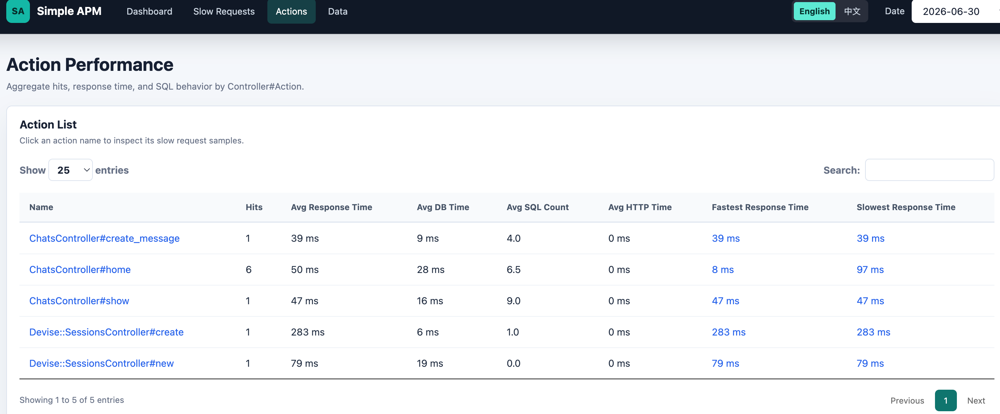
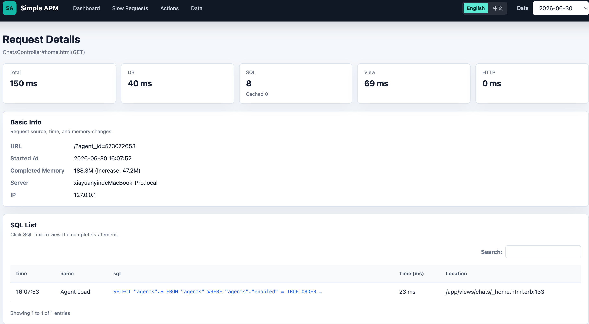
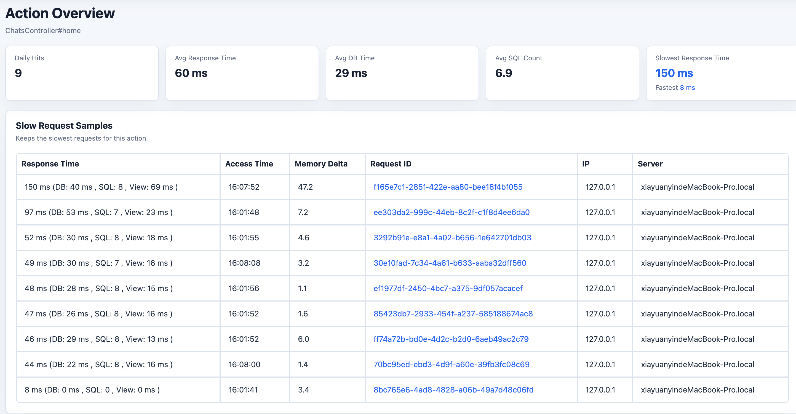
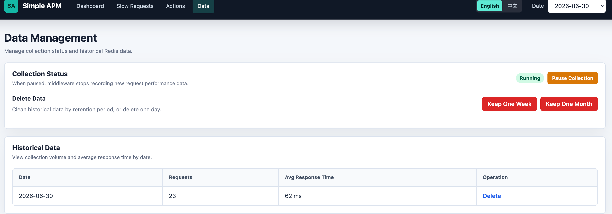

# SimpleApm (Rails Engine)

一个基于 Redis 的轻量级 Rails Engine，用于 Web 请求性能监控和慢事务追踪。

SimpleApm 以天为维度记录请求性能数据：

- 最慢请求列表，默认保留 500 条。
- 每个 action 最慢的 20 次请求。
- 每个 action 的平均响应时间。
- 慢请求详情和对应 SQL 详情，超出限制的记录会被清理。
- 以 10 分钟为粒度记录平均响应时间、最慢响应时间、请求次数等性能指标，并生成图表。
- 请求过程中外部 HTTP 访问耗时。

Web UI 支持英文和中文。默认使用英文，用户可以在右上角切换语言。

## 原理

SimpleApm 围绕 Rack 记录请求级别信息，并使用 Redis 作为数据存储和聚合工具。

核心数据传递基于 [Active Support Instrumentation](https://guides.rubyonrails.org/active_support_instrumentation.html)。

Instrumentation 事件由一个不影响主线程的常驻 worker 线程循环处理，避免请求处理阻塞在指标聚合上。

内存信息通过 [get_process_mem](https://github.com/schneems/get_process_mem) 采集。经 Linux 环境测试，采集耗时低于 1 ms。

## 功能截图

- Dashboard
  

- Slow Requests
  

- Action List
  

- Request Info
  

- Action Info
  

- Data Management
  

## 使用

在 Rails 路由中挂载 engine：

```ruby
# routes.rb
mount SimpleApm::Engine => "/apm"
```

或者运行安装命令：

```bash
rails generate simple_apm:install
```

## 安装

在应用的 Gemfile 中加入：

```ruby
gem "simple_apm"
```

然后执行：

```bash
bundle
```

## 贡献

欢迎提交 issue 和 pull request。

## License

本 gem 基于 [MIT License](http://opensource.org/licenses/MIT) 开源。
